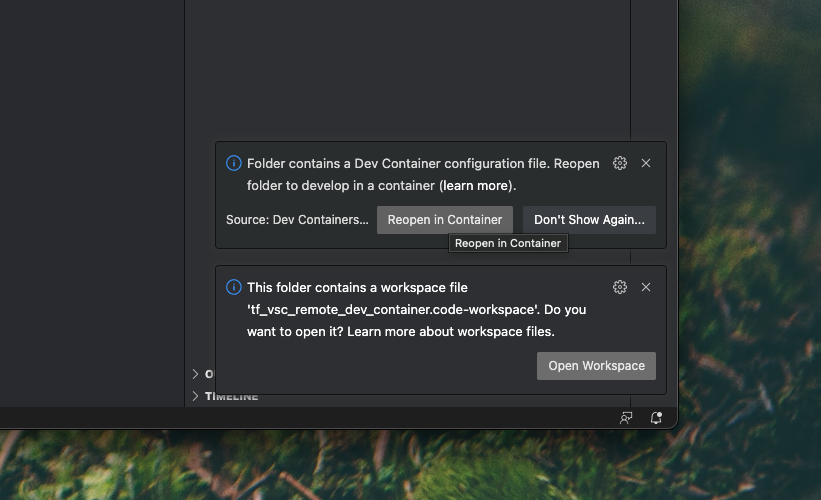

Tensorflow Remote Dev Container 
===============================

# Overview
This project uses Visual Studio Code's Remote Dev Containers to provide a remote Tensorflow 
development environment with GPU suport.
While using my private VPN, I will be able to development 
from laptop in VSC remotely on dev container running on a PC with a dedicated Nvidia
GPU at home.


# Prerequisites
## Client Laptop
- Private VPN access to home network.
- SSH access to PC at home.
- Visual Studio Code with 'Remote Containers' extension and Remote SSH extension.

## PC with GPU (Host)
- Access to private VPN.
- Installed Docker and Docker Compose.
- Installed Nvidia Drivers + CUDA.
- Installed Nvidia Container Toolkit (to support GPU in Docker containers).

## General Prerequisite(s)
- A solution to remotely switch on/off the PC at home.

## Used Technical Implementation of Prerequisite(s)
These used specific implementations  are usefull to understand
the overall setup and would need to be implemented in some way or the other.
- For the VPN Wireguard is used.
- For switching on the PC a Microcontroller with a relay is listing to a MQTT topic on an MQTT
broker in the home/VPN network.
- A bash script on the PC is listening to a different MQTT topic to preform a soft shutdown. 
- If no client connects after a remotely turned on, the PC will shutdown automatically after 10 
minutes.
- The client laptop runs MacOS.
- The host PC runs Manjaro Linux (Gnome Edition).

# Setup
## PC with GPU (Host)
Check out this project an run `docker-compose up -d` to start the dev container.
The docker compose file is configured to stay alive unless stopped. This means that the container will be restarted after a system restart of the PC host. Also the container stays running after a client disconnect consequently. 

### Quickly check if tensorflow with GPU support is working
Docker exec into the container and run the following command:
```bash
docker container exec -it jni_tf_dev_container bash
```

Start the python REPL with `python` and run the following code:
```python
from tensorflow.python.client import device_lib
device_lib.list_local_devices()
```
The output should list your GPU as an available device:


# Usage

## Client Laptop with VSC
Given all prerequisites are met, the following steps are required to start developing remotely:

### Connect to Host PC vi SSH
Open a SSH remote connection by using the command palette in VSC and selecting `Remote-SSH: Connect to Host...`.

Select your configuration. This will scan your existing SSH configurations and list them in the command palette.

### Open Project Folder
Open the project folder of the checked out project on the Host PC.


### Reopen in Container
Choose `Reopen in Container` from the command palette to connect to the dev container and start developing.


# Additional Information

## Warnings and Decisions related to the Docker Compose File
- As requested by Tensorflow the container is run by the user with the UID 1000 and GID 1000. The author does not know what will happen if this user does not exist on the host PC!
- There are no resource restrictions given in the deploy section of the docker compose file. This means that the container will use all available resources of the host PC.
- Due to issues with the latest Tensorflow image the docker compose file uses Tensorflwo 2.10.0 with GPU support.

## Installed Extensions
The remote containers installs the following extensions:
- Python (from Microsoft)
- Flake8 (from Microsoft)
- Code Spell Checker (from Street Side Software)
See the `.devcontainer/devcontainer.json` file for more information.

## Adding Python Packages Automatically
The project provides a `requirements.txt` file to install additional python packages. Though, not requirements are yet listed. If listed. These packages will installed after the
dev container is used via VSC and *not* after the container start with docker compose up.

# Sources and Links
- [Remote Development in Containers](https://code.visualstudio.com/docs/devcontainers/containers)
- [VSC Remote Containes extension](https://marketplace.visualstudio.com/items?itemName=ms-vscode-remote.remote-containers)
- [VSC Remote SSH extension](https://code.visualstudio.com/docs/remote/ssh) 
- [Quistart Guide for Tensorflow](https://www.tensorflow.org/tutorials/quickstart/beginner)


# Release History

# v0.1.0 (Untagged)
- Provide initial version of the project.
